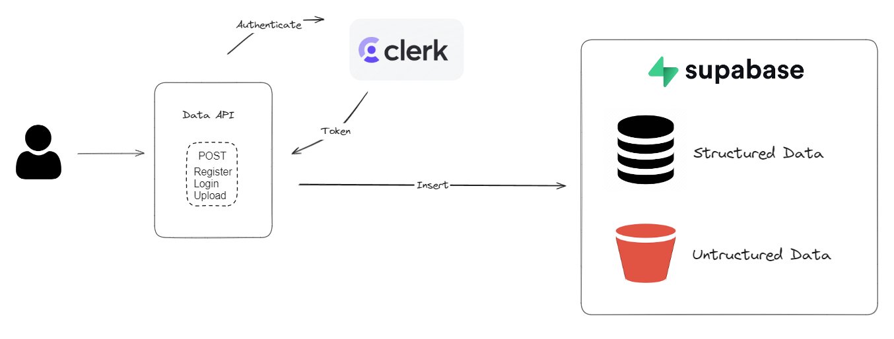

# Public API for Receiving Any Data
Public API for receiving any data with [Clerk](https://clerk.com) Authentication and [Supabase](https://supabase.com) DB.




## API Reference

#### Authentication

```http
  POST /api/v1/auth/register
```

| Parameter | Type     | Description                |
| :-------- | :------- | :------------------------- |
| `email_address` | `List[str]` | **Required**. Email of account |
| `username` | `str` | **Required**. Username of account |
| `password` | `str` | **Required**. Password Unique of account |

```http
  POST /api/v1/auth/login
```

| Parameter | Type     | Description                |
| :-------- | :------- | :------------------------- |
| `user_id` | `str` | **Required**. ID of account |
| `password` | `str` | **Required**. Password Unique of account |

#### Data

```http
  GET /api/v1/upload
```

| Parameter | Type     | Description                       |
| :-------- | :------- | :-------------------------------- |
| `username` | `str` | **Required**. Username of account |
| `user_id` | `str` | **Required**. Id of account |
| `data` | `JSON` | JSON object data |
| `file_b` | `UploadFile` | File upload form |


## Run Locally

Clone the project

```bash
  git clone https://github.com/arigofahreza/py-svc-public.git
```

Go to the project directory

```bash
  cd py-svc-public
```

Install dependencies

```bash
  pip install -r requirements.txt
```

Start the server

```bash
  uvicorn main:app --reload
```


## Deployment

To deploy this project on Docker Container

```bash
  docker build -t py-svc-public .
  docker run -d -p 8080:8080 py-svc-public
```

